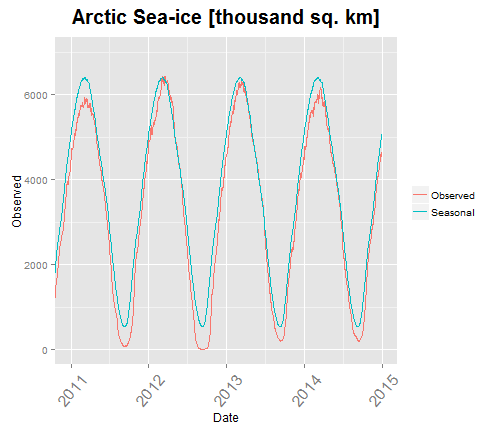

## Global Sea Ice Extent

# Motivation: 
  
- There are numerous online blogs that showcase global sea-ice data with varying levels of interactivity. I took my favorite (of the simple) data sets and built an interactive plot that allows one to zoom in to the desired time frame of interest.
  
# Shiny app:  
  
- Shiny is an R (programming language) package that makes it easy to build interactive web applications. One builds(codes) a user interface and a server. The server incorporates the "brains" of how all of the elements and data interact based upon developer and user inputs.  

--- .class #id 

## Pre-processing
- Original data and documentation is located at: (Section 3.3.4)
- http://nsidc.org/data/docs/noaa/g02135_seaice_index/

- Two sets of data are the the core of the product, the arctic ice extent set and the antarctic ice extent set. Each set contains a daily, unbroked record of sea ice since 1989. The two sets are cleaned to result in a `Date` column that contains the day and year of the observation, and an `Observation` column containing the sea ice extent on that day in units of [thousand square kilometers] 

- A `decomposition` function is applied to the observed data to calculate a seasonal extent. A global data set is the addition of the arctic and antarctic data sets.  

- The next slide shows an example plot produced by the shiny app.

--- .class #id 

## Implementation

--- .class #id 

## Distribution
The product is located at the following link:  
http://aconundrum.shinyapps.io/Global-Sea-Ice

